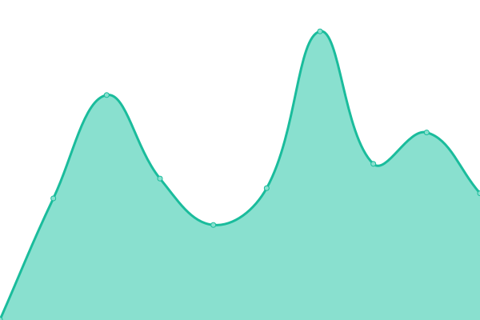

# [📈 Live Status](https://status.dikaardnt.com): <!--live status--> **🟧 Partial outage**

This repository contains the open-source uptime monitor and status page for [Dika Ardianta](https://dikaardnt.com), powered by [Upptime](https://github.com/upptime/upptime).

With [Upptime](https://upptime.js.org), you can get your own unlimited and free uptime monitor and status page, powered entirely by a GitHub repository. We use [Issues](https://github.com/DikaArdnt/upptimeku/issues) as incident reports, [Actions](https://github.com/DikaArdnt/upptimeku/actions) as uptime monitors, and [Pages](https://status.dikaardnt.com) for the status page.

<!--start: status pages-->
<!-- This summary is generated by Upptime (https://github.com/upptime/upptime) -->
<!-- Do not edit this manually, your changes will be overwritten -->
<!-- prettier-ignore -->
| URL | Status | History | Response Time | Uptime |
| --- | ------ | ------- | ------------- | ------ |
|  [REST API](https://api.dikaardnt.com) | 🟩 Up | [rest-api.yml](https://github.com/DikaArdnt/upptimeku/commits/HEAD/history/rest-api.yml) | 

 245ms
     
 | 

<a href="https://up.dikaardnt.com/history/rest-api">100.00%</a>
    

|  [Quote API](https://quote.kua.lat) | 🟩 Up | [quote-api.yml](https://github.com/DikaArdnt/upptimeku/commits/HEAD/history/quote-api.yml) | 

 1662ms
     
 | 

<a href="https://up.dikaardnt.com/history/quote-api">100.00%</a>
    

|  [WhatsApp Bot Hosting](https://hisoka.net/api) | 🟥 Down | [whats-app-bot-hosting.yml](https://github.com/DikaArdnt/upptimeku/commits/HEAD/history/whats-app-bot-hosting.yml) | 

 135ms
     
 | 

<a href="https://up.dikaardnt.com/history/whats-app-bot-hosting">100.00%</a>
    

|  [Shortener URL & Bio Page Generator](https://kua.lat/api) | 🟩 Up | [shortener-url-and-bio-page-generator.yml](https://github.com/DikaArdnt/upptimeku/commits/HEAD/history/shortener-url-and-bio-page-generator.yml) | 

 1221ms
     
 | 

<a href="https://up.dikaardnt.com/history/shortener-url-and-bio-page-generator">99.72%</a>
    

<!--end: status pages-->

[**Visit our status website →**](https://status.dikaardnt.com)

## 📄 License

- Powered by: [Upptime](https://github.com/upptime/upptime)
- Code: [MIT](./LICENSE) © [Anand Chowdhary](https://anandchowdhary.com), supported by [Pabio](https://pabio.com)
- Data in the `./history` directory: [Open Database License](https://opendatacommons.org/licenses/odbl/1-0/)
